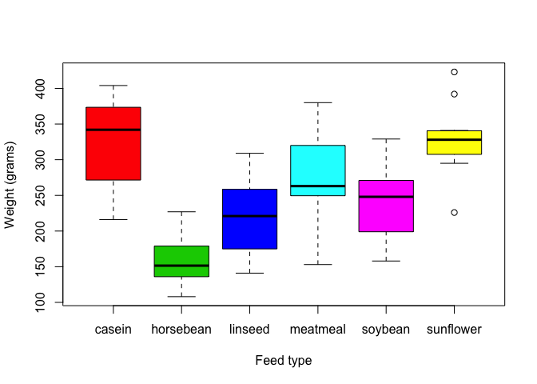

hello
=====

My first repository
===================

Welcome to my GitHub repo! :smile:

Here I will *commit*, *pull* and *push* plaintext documents and `code`.

This is a picture of a cute chick:


From this website: <https://pixabay.com/en/easter-chicks-baby-beautiful-sweet-349026/>

A new section
-------------

I just wrote *this* in RStudio!

Another new section created on GitHub
-------------------------------------

I will need to **pull** this!

Evaluated R code
----------------

The `chickwts` dataset in R has 71 rows.

``` r
plot(chickwts$weight ~ chickwts$feed,
     xlab = 'Feed type',
     ylab = 'Weight (grams)',
     col = 2:7)
```


